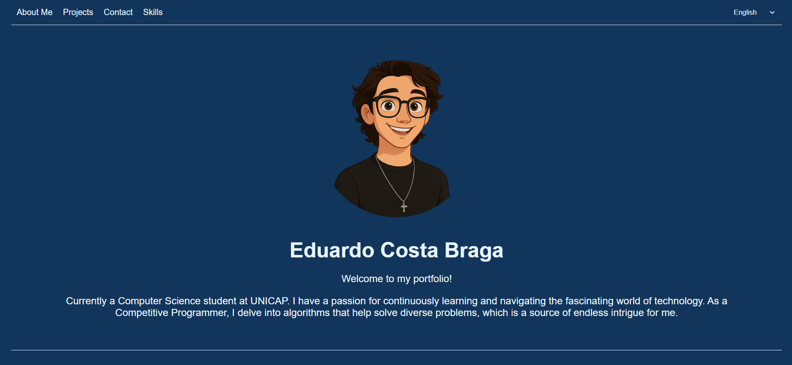

# Eduardo Costa Braga - Portfolio

Welcome to my personal portfolio! This project showcases my projects and skills as a Computer Science student and developer.

## 🌐 Live Demo
You can view the live version of my portfolio [here](https://portifolio-eduardo-pi.vercel.app/).

## 📚 Sections

1\. About Me

A brief introduction about myself, including my passion for technology, learning, and competitive programming.

2\. Projects
  
- Competitive Programming: Details my participation in programming contests.
- Lounge do Açaí: A self-service system for a local business.
- Password Game: A fun game to guess a 4-digit password.

3\. Contact

Includes links to my social media profiles and a contact form for direct communication.

4\. Skills

Displays my expertise in programming languages and tools using badges.

## 🕹️ Password Game
The portfolio includes a fun implementation of the Bulls and Cows game:

- Guess a 4-digit password.
- View your previous attempts and results (Bulls and Cows).
- Reveal the secret password with a button.
