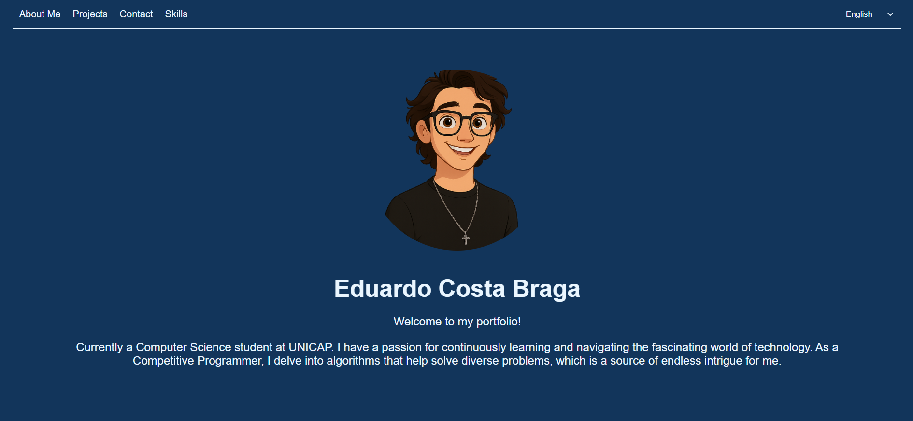

# 🚀 Portfólio Web
> Projeto da disciplina de [Programação Web e Mobile](https://github.com/Dudubraga/unicap-cc-programacao-web-e-mobile)

## 📖 Visão Geral

Welcome to my personal portfolio! This project showcases my projects and skills as a Computer Science student and developer.

- **Instituição:** UNICAP
- **Professor:** Marcio Bueno
- **Período:** 2025.1

## ✨ Funcionalidades

- A brief introduction about myself, including my passion for technology, learning, and competitive programming.
- A list of projects
- Includes links to my social media profiles and a contact form for direct communication.
- Displays my expertise in programming languages and tools using badges.
- 🕹️ Password Game - the portfolio includes a fun implementation of the Bulls and Cows game.

## 🛠️ Tecnologias Utilizadas

- **Frontend**: HTML, JavaScript
- **Estilização**: CSS
  
## 🌐 Live Demo

Acesse a versão publicada do quiz através deste [link](https://projeto-web-mobile-seven.vercel.app/).
